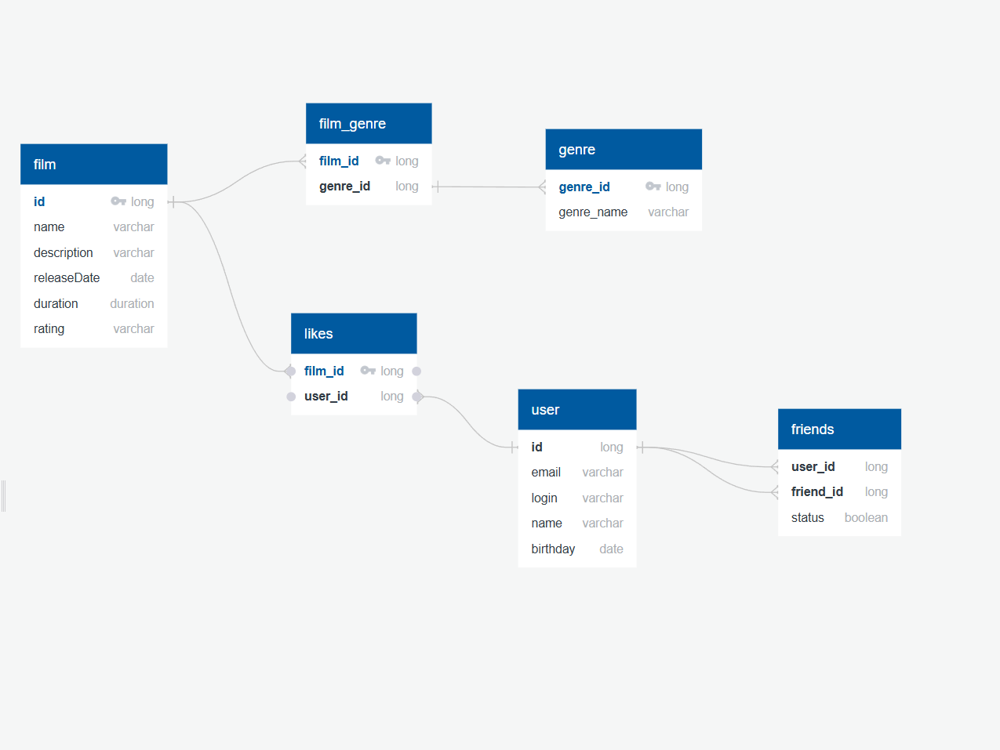

film
id(int) - идентификатор фильма

name(varchar) - название фильма

description(varchar) - описание фильма

release_date(date) - дата релиза фильма

duration(int) - продолжительность фильма в минутах

rating(varchar) - возрастной рейтинг фильма

1 - G - нет возрастных ограничений.
2 - PG - рекомендуют смотреть с родителями.
3 - PG-13 - до 13 лет просмотр не желателен.
4 - R - до 17 лет только в присутствии взрослого.
5 - NC-17 - до 18 лет просмотр запрещен.

genre
genre_id(int) - идентификатор жанра

genre_name(varchar) - название жанра

1 - Комедия.
2 - Драма.
3 - Мультфильм.
4 - Триллер.
5 - Документальный.
6 - Боевик.

film_genre
film_id(int) - идентификатор фильма

genre_id(int) - идентификатор жанра

likes
film_id(int) - идентификатор фильма, которому поставили лайк

user_id(int) - идентификатор пользователя, который поставил лайк

user
id(int) - идентификатор пользователя

email(varchar) - электронная почта пользователя

login(varchar) - логин пользователя

name(varchar) - имя пользователя

birthday(date) - дата рождения пользователя

friends
user_id(int) - идентификатор пользователя, который отправил запрос на добавление в друзья

friend_id(int) - идентификатор пользователя, которому поступил запрос в друзья

status(boolean) - показывает, принял ли пользователь запрос на дружбу или нет

true - принял
false - ожидает подтверждения/отклонил

SELECT f.name
FROM films AS f
INNER JOIN rating AS r ON r.id = f.rating_id
WHERE f.name LIKE '%Love%'
AND r.ratingName = 'R';

SELECT f.description
FROM films AS f
INNER JOIN rate AS r ON r.id = f.rate_id
WHERE r.rateName = 'Комедия';

SELECT f.name
FROM films AS f
INNER JOIN users AS u ON u.id = f.user_id
WHERE f.user_id LIKE '1';