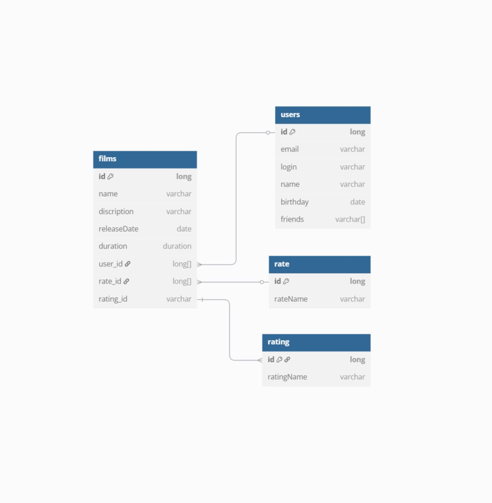

films - таблица с фильмами(PK: id; FK: user_id, rate_id, rating_id)
users - таблица с пользователями (PK: id)
rate - таблица с жанрами(PK: id)
rating -таблица с рейтингом (PK: id)

SELECT f.name
FROM films AS f
INNER JOIN rating AS r ON r.id = f.rating_id
WHERE f.name LIKE '%Love%'
AND r.ratingName = 'R';

SELECT f.description
FROM films AS f
INNER JOIN rate AS r ON r.id = f.rate_id
WHERE r.rateName = 'Комедия';

SELECT f.name
FROM films AS f
INNER JOIN users AS u ON u.id = f.user_id
WHERE f.user_id LIKE '1';